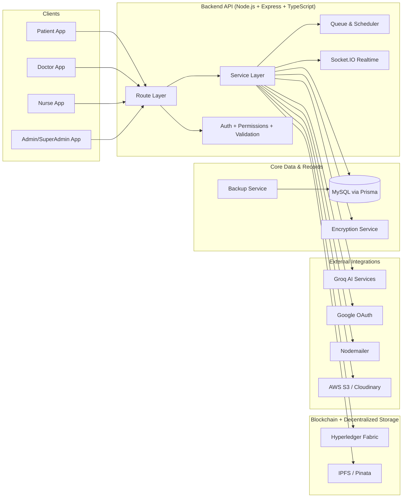

# GP

## System Architecture (Demo-Slide Friendly)

### Quick Read (for speaking over the slide)
- **Users (patients, nurses, doctors, admins)** call the backend API.
- The backend enforces **authentication, authorization, and validation**, then runs business logic in services.
- Clinical data is stored in **MySQL (Prisma)** with supporting encryption and backup workflows.
- Trust-sensitive records are anchored through **Hyperledger Fabric**, with large artifacts handled through **IPFS/Pinata**.
- The backend also integrates with **AI**, **Google OAuth**, **email**, and **file storage** services.
